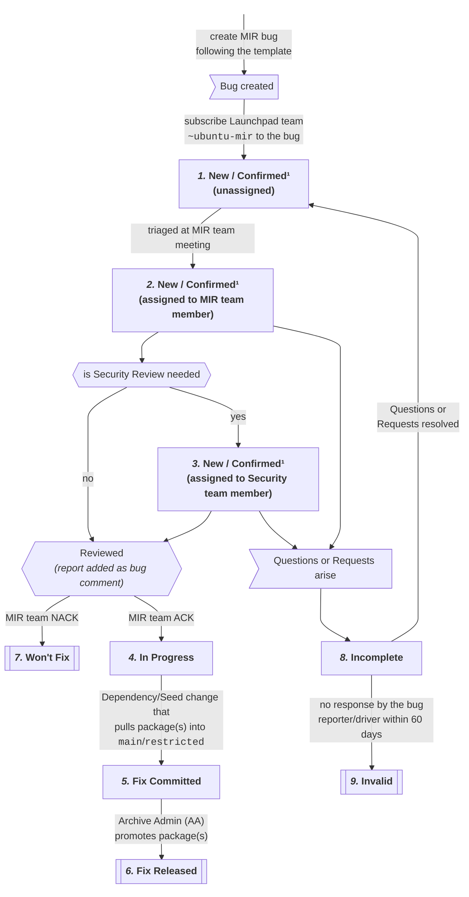

# Introduction

Packages in Ubuntu main (and restricted) are officially maintained,
supported and recommended by the Ubuntu project. Security updates are
provided for them as necessary by Canonical, and Canonical\'s standard
support services apply to these packages.

Therefore, special consideration is necessary before adding new packages
to these components. The [Ubuntu MIR
Team](https://launchpad.net/~ubuntu-mir) reviews packages for
promotion from universe to main.

That is the *Main Inclusion Review* =\> MIR

## Process States

This overview aims to clarify the meaning of MIR bug states, address previous 
confusion, and indicate the next course of action on a MIR bug.



| State                                                    | Explanation |
|----------------------------------------------------------|-------------|
| *1.* New / Confirmed¹ (unassigned)                       | bug is queued for assignment to a MIR team member |
| *2.* New / Confirmed¹ (assigned to MIR team member)      | on the TODO list of the assigned MIR team member |
| *3.* New / Confirmed¹ (assigned to Security team member) | on the TODO list of the Security team member |
| *4.* In Progress                                         | MIR team ACK (and if needed, Security team ACK) done, but now needs the Dependency/Seed change to happen to pull package(s) into `main`/`restricted` |
| *5.* Fix Committed                                       | all of the above done; waiting for an Archive Admin to promote the package(s) to `main`/`restricted` |
| *6.* Fix Released                                        | case resolved by an Archive Admin |
| *7.* Won\'t Fix                                          | final NACK from MIR team or bug reporter gave up |
| *8.* Incomplete                                          | Questions/Requests were raised for the bug reporter to resolve/clarify |
| *9.* Invalid¹                                            | no response within 60 days when in `Incomplete` state |
| *10.* Invalid¹                                            | not promoted to main by owning-team 2 years after MIR approval |

**Note:** All other states are undefined and should be resolved to
one of the defined states – otherwise they might be completely missed on the weekly checks.

**Hint:** transitioning from *2.*/*3.* to *4.*/*5.*/*8.*: The successor of 
assigned `New` states depends *(as seen by multiple arrows in the state 
diagram)* on the package(s) current state in the archive: 
 * A NACK from the MIR or Security team will result in the `7. Won't Fix` state.
   A former reviewer will get unassigned. (If there is context to believe that 
   there might be a follow up by the reporter the reviewer might keep assigned.)
 * In case of an ACK from the MIR team (and, if required the Security team), if 
   the package(s) is/are already tried to be pulled into `main`/`restricted` 
   then the next state is `5. (Fix Committed)`, otherwise the next state is 
   `4. In Progress`. Seen in:
     * [component mismatches for `main`/`restricted`](https://people.canonical.com/~ubuntu-archive/component-mismatches.svg) 
     * [component mismatches for `proposed`](https://people.canonical.com/~ubuntu-archive/component-mismatches-proposed.svg)

**¹** Since many people set Launchpad bugs to `Confirmed` once they verified 
the validity of a problem, MIR bugs often get set to `Confirmed`. Since 
`Confirmed` does not have any meaning for our process, we will handle `New` and 
`Confirmed` as if they are the same.

# Exceptions


## Font Packages

Fonts packages given that fonts are just data, there\'s no way for them
to trip any of the problems that would cause us to not want to support
it. Therefore not all of the process has to be followed for these.
Unfortunately there were cases where src:font-\* packages contained way
more than just a font - due to that either the MIR Team (if a MIR bug
was filed) or the Ubuntu-Archive team (on promoting it) has to do a spot
check that neither the source nor the created binary packages violate
these assumptions.

The only limitation is that the package needs a valid team subscriber
before being promoted by an archive admin - just in case anything might
come up later. The MIR Team should try to clarify that with the Team
that owns the depending package to own the font as well (read: without
the overhead of a full MIR process).

# Filing a MIR bug

The steps of the MIR process require a reporter (the one who wants a
package promoted) a MIR team member (who does the review) and
potentially a Security team member (for an extra review).

The MIR-bug reporter is expected to:

1. Thoroughly go through TODO/RULE entries in [Ubuntu Main Inclusion RULEs and TODOs](#main-inclusion-requirements), check that the package meets all the points there. If this package has nontrivial problems, it is not eligible for main inclusion, and needs to be fixed first.
   1. Write down issues that violate the requirements and list them in the MIR bug
   1. Write down all positive checks that you did as well (not only the issues)
1. File a bug report about the package, titled "[MIR] sourcepackagename".
   1. use below template from [Ubuntu Main Inclusion RULEs and TODOs](#main-inclusion-requirements)
   1. For each rule include a positive or negative statement as confirmation that you checked each requirement carefully.
   1. For any rule violations ensure to explain why it should be ok for this case.
1. Subscribe `ubuntu-mir` to the bug report (keep it in state "NEW" and do not assign it to anyone!), so that it appears in the  [MIR bug list](https://bugs.launchpad.net/ubuntu/?field.searchtext=&orderby=-date_last_updated&field.status%3Alist=NEW&assignee_option=none&field.assignee=&field.subscriber=ubuntu-mir).
1. The [MIR team](https://launchpad.net/~ubuntu-mir) reviews the reports, and sets acceptable ones to *In Progress* or *Fix Committed*. They might also delegate portions of the review to other teams, by assigning it to them; common cases are getting a thorough security review from the [security team](https://launchpad.net/~ubuntu-security) (please see [SecurityTeam/Auditing](https://wiki.ubuntu.com/SecurityTeam/Auditing) for details on requesting an audit and the [security team Jira board](https://warthogs.atlassian.net/jira/software/c/projects/SEC/boards/594)` (private board) for prioritized list of MIR security reviews), or getting a sign-off from particular team leads about maintenance commitments.
   1. In the case where an MIR needs a security review, a normal MIR review will happen by a member of the MIR team and the security review by a member of the security team. Among these team members, whoever does the last review shall adjust the bug status accordingly. For instance, if MIR team says ok then security says ok, the security team member should mark the bug as Fix Committed (see above for other statuses).
   1. In case the MIR Team (or later other reviewers) identify tasks that need to be done the bug is set to "incomplete" to reflect that is back on the reporter to drive that forward before more progress can be made. Common Examples are "please add an automated test" or "this needs the new version"

1. The submitter should then take responsibility for adding the package to the seeds as per SeedManagement or adding a dependency to it from another package that already is in `main`. The package will not be moved to main automatically, but will show up in the [component-mismatches](https://people.ubuntu.com/~ubuntu-archive/component-mismatches.txt)
list, or if the dependency is only in proposed, the [component-mismatches-proposed](https://people.canonical.com/~ubuntu-archive/component-mismatches-proposed.txt) list.
   1. Archive administrators will review the component-mismatches output, and for each package waiting to move into `main`, look for a corresponding [bug](https://bugs.launchpad.net/~ubuntu-mir/+subscribedbugs).
   1. The archive administrators will promote approved packages to `main` if some other package or the seeds want it (see  [component-mismatches output](https://people.ubuntu.com/~ubuntu-archive/component-mismatches.txt)) and the package in question has an owning team subscribed to it.

Notes:

 * MIR bugs should always be named for SOURCE packages, not binary packages
 * New binary packages from existing source packages, where the source package is already in main, do not require MIR bugs.
 * If a new source package contains only code which is already in main (e.g. the result of a source package split or rename, or source packages with a version in the name), it may not need a full review. Submitting a MIR bug with an explanation (but without the full template) or updating/extending on the existing old MIR bug and re-opening it by setting it to "NEW" is sufficient.

## Templates and Rules

It is the task of the reporter/reviewer to evaluate all the entries
listed in *RULE* sections and based on that to answer or adapt all
*TODO* entries to create the content for the MIR request or the review
feedback respectively.

The sum of *RULE* sections is not meant to be complete without the
*TODO* entries. Only combined they define the full rules as that allows
to avoid duplication.

On one hand the *TODO* entries shall cover everything we expect from a
report. These shall help to create a concise yet complete content of
each report/review.

On the other hand the *RULE* entries provide additional background,
details, options and interpretation help.

In many cases where rules are rather simple they only appear as *TODO*
as they do not need additional explanation.

The reporter/reviewer is tasked to use the templates the following way:

1. Copy the full template below into an editor of your choice
1. Read the lines starting with *RULE* for all aspects of the MIR
1. For each line marked with *TODO*
   1. Adapt the line to provide the correct answer matching the package(s) that you request.
   1. In some of those lines you'll need to replace placeholders 'TBD' and 'TBDSRC' with whatever matches your request
   1. Remove the *TODO* prefix when you are sure you answered a statement
   1. Some *TODO* lines can just be removed if they do not apply to the case, for example if you do not have "additional reasons" to state
   1. Sometimes mutually exclusive options are provided like "link to CVE" or "no security issues in the past", leave only those statements that apply.
      - To assist the template-user those alternatives are marked like *TODO-A:, TODO-B:, ...*. Of those one would usually expect only one to remain in the final content.
   1. The MIR Team reviewer will have to judge, therefore all his statements start in an *OK:* section. But any time a violation is found the statement is moved to the *Problems:* area and flagged what is missing/expected. If no *Problems:* are present leave just the alternative *Problems: None* for posting the review.
1. Remove the lines starting with *RULE* after you have processed them
1. Eventually all you will have left are the categories Availability, Rationale, ... and therein the answers that the MIR process expects
1. You can and are encouraged to always add more details/background that make the case comprehensible
1. Update the MIR Bug
   1. Reporter: File the MIR bug based on the processed template as the bug description
      - In case of a single context/reasoning, but multiple packages to promote please make a Launchpad bug for each package. One central package may be chosen to maintain the shared context of related packages. Other packages must be tracked by and link to the central package. See the [central Pacemaker MIR](https://bugs.launchpad.net/ubuntu/+source/pcs/+bug/1953341) as an example.
   1. MIR-Team: Review and add a comment to the bug that contains the review

## Main Inclusion requirements

Use this template for the MIR bug report that you will file.

Usage follows [Templates and Rules](#templates-and-rules).

The package must fulfill the following requirements.

```
[Availability]
TODO: The package TBDSRC is already in Ubuntu universe.
TODO: The package TBDSRC build for the architectures it is designed to work on.
TODO: It currently builds and works for architectures: TBD
TODO: Link to package https://launchpad.net/ubuntu/+source/TBDSRC

[Rationale]
RULE: There must be a certain level of demand for the package
TODO: - The package TBDSRC is required in Ubuntu main for TBD
TODO-A: - The package TBDSRC will generally be useful for a large part of
TODO-A:   our user base
TODO-B: - The package TBDSRC will not generally be useful for a large part of
TODO-B:   our user base, but is important/helpful still because TBD
TODO: - Additional reasons TBD
TODO: - Additionally new use-cases enabled by this are TBD
TODO: - Package TBDSRC covers the same use case as TBD, but is better
TODO:   because TBD, thereby we want to replace it.
TODO: - The package TBDSRC is a new runtime dependency of package TBD that
TODO:   we already support
RULE: Sometimes there are other/better ways, often are achieved by using a
RULE: library with similar functionality that is more commonly used and
RULE: thereby already in main or a better candidate to promote.
RULE: Reducing the set of supported software in Ubuntu helps to focus on the
RULE: right things, otherwise Ubuntu developers will be consumed by updating
RULE: many variations of the same - wasting valuable time that could be better
RULE: spent elsewhere.
RULE: If there are other packages in the archive that are close, but unable to
RULE: address the problem you might spend some time explaining what exists and
RULE: why it isn't a sufficient alternative.
TODO: - There is no other/better way to solve this that is already in main or
TODO:   should go universe->main instead of this.
RULE: You truly need to understand the difference between main and universe
RULE: in general and in the context of changed rules (build-depends) and
RULE: constraints (Ubuntu Pro made it less of a difference in many cases).
RULE: We have seen requests that were mostly based on old "I said supported (a
RULE: weakly defined term to begin with) in a contract, so it has to be in main"
RULE: feelings, but with sometimes no true reason - neither technically nor
RULE: helping the user base of Ubuntu. Hence we need to ask for that clearly.
TODO: - The binary package TBD needs to be in main to achieve TBD

RULE: Reviews will take some time. Also the potential extra work out of review
RULE: feedback from either MIR-team and/or security-team will take time.
RULE: For better prioritization it is quite helpful to clearly state the
RULE: target release and set a milestone to the bug task.
RULE: When doing so do not describe what you "wish" or "would like to have".
RULE: Only milestones that are sufficiently well-founded and related to
RULE: major releases will be considered
TODO-A: - The package TBDSRC is required in Ubuntu main no later than TBD
TODO-A:   due to TBD
TODO-B: - It would be great and useful to community/processes to have the
TODO-B:   package TBD in Ubuntu main, but there is no definitive deadline.

[Security]
RULE: The security history and the current state of security issues in the
RULE: package must allow us to support the package for at least 9 months (120
RULE: for LTS+ESM support) without exposing its users to an inappropriate level
RULE: of security risks. This requires checking of several things:
RULE:   - Search in the National Vulnerability Database using the PKG as keyword
RULE:     https://cve.mitre.org/cve/search_cve_list.html
RULE:   - check OSS security mailing list (feed into search engine
RULE:     'site:www.openwall.com/lists/oss-security <pkgname>')
RULE:   - Ubuntu CVE Tracker
RULE:     https://ubuntu.com/security/cve?package=<source-package-name>
RULE:   - Debian Security Tracker
RULE:     https://security-tracker.debian.org/tracker/source-package/<source-package-name>
TODO-A: - Had #TBD security issues in the past
TODO-A:   - TBD links to such security issues in trackers
TODO-A:   - TBD to any context that shows how these issues got handled in
TODO-A:     the past
TODO-B: - No CVEs/security issues in this software in the past

RULE: - Check for security relevant binaries, services and behavior.
RULE:   If any are present, this requires a more in-depth security review.
RULE:   Demonstrating that common isolation/risk-mitigation patterns are used
RULE:   will help to raise confidence. For example a service running as root
RULE:   open to the network will need to be considered very carefully. The same
RULE:   service dropping the root permissions after initial initialization,
RULE:   using various systemd isolation features and having a default active
RULE:   apparmor profile is much less concerning and can speed up acceptance.
RULE:   This helps Ubuntu, but you are encouraged to consider working with
RULE:   Debian and upstream to get those security features used at wide scale.
RULE: - It might be impossible for the submitting team to check this perfectly
RULE:   (the security team will), but you should be aware that deprecated
RULE:   security algorithms like 3DES or TLS/SSL 1.1 are not acceptable.
RULE:   If you think a package might do that it would be great to provide a
RULE:   hint for the security team like "Package may use deprecated crypto"
RULE:   and provide the details you have about that.
TODO: - no `suid` or `sgid` binaries
TODO-A: - no executables in `/sbin` and `/usr/sbin`
TODO-B: - Binary TBD in sbin is no problem because TBD
TODO-A: - Package does not install services, timers or recurring jobs
TODO-B: - Package does install services, timers or recurring jobs
TODO-B:   TBD (list services, timers, jobs)
TODO: - Security has been kept in mind and common isolation/risk-mitigation
TODO:   patterns are in place utilizing the following features:
TODO:   TBD (add details and links/examples about things like dropping
TODO:   permissions, using temporary environments, restricted users/groups,
TODO:   seccomp, systemd isolation features, apparmor, ...)
TODO-A: - Packages does not open privileged ports (ports < 1024).
TODO-B: - Packages open privileged ports (ports < 1024), but they have
TODO-B:   a reason to do so (TBD)
TODO-A: - Package does not expose any external endpoints
TODO-B: - Package does expose an external endpoint, it is
TODO-B:   TBD endpoint + TBD purpose
TODO: - Packages does not contain extensions to security-sensitive software
TODO:   (filters, scanners, plugins, UI skins, ...)

RULE: The package should not use deprecated security algorithms like 3DES or
RULE: TLS/SSL 1.1. The security team is the one responsible to check this,
RULE: but if you happen to spot something it helps to provide a hint.
RULE: Provide whatever made you suspicious as details along that statement.
RULE: Or remove the following lines entirely if you did not spot anything.
TODO: - I've spotted what I consider deprecated algorithms, the security team
TODO:   should have a more careful look please, details are:

[Quality assurance - function/usage]
RULE: - After installing the package it must be possible to make it working with
RULE:   a reasonable effort of configuration and documentation reading.
TODO-A: - The package works well right after install
TODO-B: - The package needs post install configuration or reading of
TODO-B:   documentation, there isn't a safe default because TBD

[Quality assurance - maintenance]
RULE: - To support a package, we must be reasonably convinced that upstream
RULE:   supports and cares for the package.
RULE: - The status of important bugs in Debian, Ubuntu and upstream's bug
RULE:   tracking systems must be evaluated. Important bugs must be pointed out
RULE:   and discussed in the MIR report.
TODO: - The package is maintained well in Debian/Ubuntu/Upstream and does
TODO:   not have too many, long-term & critical, open bugs
TODO:   - Ubuntu https://bugs.launchpad.net/ubuntu/+source/TBDSRC/+bug
TODO:   - Debian https://bugs.debian.org/cgi-bin/pkgreport.cgi?src=TBDSRC
TODO:   - Upstream's bug tracker, e.g., GitHub Issues
TODO: - The package has important open bugs, listing them: TBD
TODO-A: - The package does not deal with exotic hardware we cannot support
TODO-B: - The package does deal with exotic hardware, it is present at TBD
TODO-B:   to be able to test, fix and verify bugs

[Quality assurance - testing]
RULE: - The package must include a non-trivial test suite
RULE:   - it should run at package build and fail the build if broken
TODO-A: - The package runs a test suite on build time, if it fails
TODO-A:   it makes the build fail, link to build log TBD
TODO-B: - The package does not run a test at build time because TBD

RULE:   - The package should, but is not required to, also contain
RULE:     non-trivial autopkgtest(s).
TODO-A: - The package runs an autopkgtest, and is currently passing on
TODO-A:   this TBD list of architectures, link to test logs TBD
TODO-B: - The package does not run an autopkgtest because TBD

RULE: - existing but failing tests that shall be handled as "ok to fail"
RULE:   need to be explained along the test logs below
TODO-A: - The package does have not failing autopkgtests right now
TODO-B: - The package does have failing autopkgtests tests right now, but since
TODO-B:   they always failed they are handled as "ignored failure", this is
TODO-B:   ok because TBD

RULE: - If no build tests nor autopkgtests are included, and/or if the package
RULE:   requires specific hardware to perform testing, the subscribed team
RULE:   must provide a written test plan in a comment to the MIR bug, and
RULE:   commit to running that test either at each upload of the package or
RULE:   at least once each release cycle. In the comment to the MIR bug,
RULE:   please link to the codebase of these tests (scripts or doc of manual
RULE:   steps) and attach a full log of these test runs. This is meant to
RULE:   assess their validity (e.g. not just superficial).
RULE:   If possible such things should stay in universe. Sometimes that is
RULE:   impossible due to the way how features/plugins/dependencies work
RULE:   but if you are going to ask for promotion of something untestable
RULE:   please outline why it couldn't provide its value (e.g. by splitting
RULE:   binaries) to users from universe.
RULE:   This is a balance that is hard to strike well, the request is that all
RULE:   options have been exploited before giving up. Look for more details
RULE:   and backgrounds https://github.com/canonical/ubuntu-mir/issues/30
RULE:   Just like in the SRU process it is worth to understand what the
RULE:   consequences a regression (due to a test miss) would be. Therefore
RULE:   if being untestable we ask to outline what consequences this would
RULE:   have for the given package. And let us be honest, even if you can
RULE:   test you are never sure you will be able to catch all potential
RULE:   regressions. So this is mostly to force self-awareness of the owning
RULE:   team than to make a decision on.
TODO: - The package can not be well tested at build or autopkgtest time
TODO:   because TBD. To make up for that:
TODO-A:   - We have access to such hardware in the team
TODO-B:   - We have allocated budget to get this hardware, but it is not here
TODO-B:     yet
TODO-C:   - We have checked with solutions-qa and will use their hardware
TODO-C:     through testflinger
TODO-D:   - We have checked with other team TBD and will use their hardware
TODO-D:     through TBD (eg. MAAS)
TODO-E:   - We have checked and found a simulator which covers this case
TODO-E:     sufficiently for testing, our plan to use it is TBD
TODO-F:   - We have engaged with the upstream community and due to that
TODO-F:     can tests new package builds via TBD
TODO-G:   - We have engaged with our user community and due to that
TODO-G:     can tests new package builds via TBD
TODO-H:   - We have engaged with the hardware manufacturer and made an
TODO-H:     agreement to test new builds via TBD
TODO-A-H: - Based on that access outlined above, here are the details of the
TODO-A-H:   test plan/automation TBD (e.g. script or repo) and (if already
TODO-A-H:   possible) example output of a test run: TBD (logs).
TODO-A-H:   We will execute that test plan
TODO-A-H1:  on-uploads
TODO-A-H2:  regularly (TBD details like frequency: monthly, infra: jira-url)
TODO-X:   - We have exhausted all options, there really is no feasible way
TODO-X:     to test or recreate this. We are aware of the extra implications
TODO-X:     and duties this has for our team (= help SEG and security on
TODO-X:     servicing this package, but also more effort on any of your own
TODO-X:     bug triage and fixes).
TODO-X:     Due to TBD there also is no way to provide this to users from
TODO-X:     universe.
TODO-X:     Due to the nature, integration and use cases of the package the
TODO-X:     consequences of a regression that might slip through most likely
TODO-X:     would include
TODO-X:     - TBD
TODO-X:     - TBD
TODO-X:     - TBD

RULE: - In some cases a solution that is about to be promoted consists of
RULE:   several very small libraries and one actual application uniting them
RULE:   to achieve something useful. This is rather common in the go/rust space.
RULE:   In that case often these micro-libs on their own can and should only
RULE:   provide low level unit-tests. But more complex autopkgtests make no
RULE:   sense on that level. Therefore in those cases one might want to test on
RULE:   the solution level.
RULE:   - Process wise MIR-requesting teams can ask (on the bug) for this
RULE:     special case to apply for a given case, which reduces the test
RULE:     constraints on the micro libraries but in return increases the
RULE:     requirements for the test of the actual app/solution.
RULE:   - Since this might promote micro-lib packages to main with less than
RULE:     the common level of QA any further MIRed program using them will have
RULE:     to provide the same amount of increased testing.
TODO: - This package is minimal and will be tested in a more wide reaching
TODO:   solution context TBD, details about this testing are here TBD

[Quality assurance - packaging]
RULE: - The package uses a debian/watch file whenever possible. In cases where
RULE:   this is not possible (e.g. native packages), the package should either
RULE:   provide a debian/README.source file or a debian/watch file (with
RULE:   comments only) providing clear instructions on how to generate the
RULE:   source tar file.
TODO-A: - debian/watch is present and works
TODO-B: - debian/watch is not present, instead it has TBD
TODO-C: - debian/watch is not present because it is a native package

RULE: - The package should define the correct "Maintainer:" field in
RULE:   debian/control. This needs to be updated, using `update-maintainer`
RULE:   whenever any Ubuntu delta is applied to the package, as suggested by
RULE:   dpkg (LP: #1951988)
TODO: - debian/control defines a correct Maintainer field

RULE: - It is often useful to run `lintian --pedantic` on the package to spot
RULE:   the most common packaging issues in advance
RULE: - Non-obvious or non-properly commented lintian overrides should be
RULE:   explained
TODO: - This package does not yield massive lintian Warnings, Errors
TODO: - Please link to a recent build log of the package <TBD>
TODO: - Please attach the full output you have got from
TODO:   `lintian --pedantic` as an extra post to this bug.
TODO-A: - Lintian overrides are not present
TODO-B: - Lintian overrides are present, but ok because TBD

RULE: - The package should not rely on obsolete or about to be demoted packages.
RULE:   That currently includes package dependencies on Python2 (without
RULE:   providing Python3 packages), and packages depending on GTK2.
TODO: - This package does not rely on obsolete or about to be demoted packages.
TODO: - This package has no python2 or GTK2 dependencies

RULE: - Debconf questions should not bother the default user too much
TODO-A: - The package will be installed by default, but does not ask debconf
TODO-A:   questions higher than medium
TODO-B: - The package will not be installed by default

RULE:  - The source packaging (in debian/) should be reasonably easy to
RULE:   understand and maintain.
TODO-A: - Packaging and build is easy, link to debian/rules TBD
TODO-B: - Packaging is complex, but that is ok because TBD

[UI standards]
TODO-A: - Application is not end-user facing (does not need translation)
TODO-B: - Application is end-user facing, Translation is present, via standard
TODO-B:   intltool/gettext or similar build and runtime internationalization
TODO-B:   system see TBD

TODO-A: - End-user applications that ships a standard conformant desktop file,
TODO-A:   see TBD
TODO-B: - End-user applications without desktop file, not needed because TBD

[Dependencies]
RULE: - In case of alternative the preferred alternative must be in main.
RULE: - Build(-only) dependencies can be in universe
RULE: - If there are further dependencies they need a separate MIR discussion
RULE:   (this can be a separate bug or another task on the main MIR bug)
TODO-A: - No further depends or recommends dependencies that are not yet in main
TODO-B: - There are further dependencies that are not yet in main, MIR for them
TODO-B:   is at TBD
TODO-C: - There are further dependencies that are not yet in main, the MIR
TODO-C:   process for them is handled as part of this bug here.

[Standards compliance]
RULE: - Major violations should be documented and justified.
RULE:   - FHS: https://refspecs.linuxfoundation.org/fhs.shtml
RULE:   - Debian Policy: https://www.debian.org/doc/debian-policy/
TODO-A: - This package correctly follows FHS and Debian Policy
TODO-B: - This package violates FHS or Debian Policy, reasons for that are TBD

[Maintenance/Owner]
RULE: The package must have an acceptable level of maintenance corresponding
RULE: to its complexity:
RULE: - All packages must have a designated "owning" team, regardless of
RULE:   complexity.
RULE:   This requirement of an owning-team comes in two aspects:
RULE:   - A case needs to have a team essentially saying "yes we will own that"
RULE:     to enter the MIR process. Usually that is implied by team members
RULE:     filing MIR requests having the backup by their management for the
RULE:     long term commitment this implies.
RULE:     - A community driven MIR request might be filed to show the use case,
RULE:       but then, as a first step, needs to get a team agreeing to own
RULE:       it before the case can be processed further.
RULE:       If unsure which teams to consider have a look at the current mapping
RULE:       http://reqorts.qa.ubuntu.com/reports/m-r-package-team-mapping.html
RULE:       In that case (you are not a representative of the team who will
RULE:       gain the long term committment to this) please ask a representative
RULE:       of that team to comment on the bug acknowledging that they are ok to
RULE:       own it.
RULE:   - The package needs a bug subscriber before it can be promoted to main.
RULE:     Strictly speaking that subscription can therefore wait until the
RULE:     moment of the actual promotion by an archive admin. But it is
RULE:     strongly recommended to subscribe early, as the owning team will get
RULE      a preview of the to-be-expected incoming bugs later on.
RULE: - Simple packages (e.g. language bindings, simple Perl modules, small
RULE:   command-line programs, etc.) might not need very much maintenance
RULE:   effort, and if they are maintained well in Debian we can just keep them
RULE:   synced. They still need a subscribing team to handle bugs, FTBFS and
RULE:   tests
RULE: - More complex packages will usually need a developer or team of
RULE:   developers paying attention to their bugs, whether that be in Ubuntu
RULE:   or elsewhere (often Debian). Packages that deliver major new headline
RULE:   features in Ubuntu need to have commitment from Ubuntu developers
RULE:   willing to spend substantial time on them.
TODO-A: - The owning team will be TBD and I have their acknowledgement for
TODO-A:   that commitment
TODO-B: - I Suggest the owning team to be TBD
TODO-A: - The future owning team is already subscribed to the package
TODO-B: - The future owning team is not yet subscribed, but will subscribe to
TODO-B:   the package before promotion

RULE: - Responsibilities implied by static builds promoted to main, which is
RULE:   not a recommended but a common case with golang and rust packages.
RULE:   - the security team will track CVEs for all vendored/embedded sources in main
RULE:   - the security team will provide updates to main for all `golang-*-dev`
RULE:     packages
RULE:   - the security team will provide updates to main for non-vendored
RULE:     dependencies as per normal procedures (including e.g.,
RULE:     sponsoring/coordinating uploads from teams/upstream projects, etc)
RULE:   - the security team will perform no-change-rebuilds for all packages
RULE:     listing an CVE-fixed package as Built-Using and coordinate testing
RULE:     with the owning teams responsible for the rebuilt packages
RULE:   - for packages that build using any `golang-*-dev` packages:
RULE:     - the owning team must state their commitment to test
RULE:       no-change-rebuilds triggered by a dependent library/compiler and to
RULE:       fix any issues found for the lifetime of the release (including ESM
RULE:       when included)
RULE:     - the owning team must provide timely testing of no-change-rebuilds
RULE:       from the security team, fixing the rebuilt package as necessary
RULE:   - for packages that build with approved vendored code:
RULE:     - the owning team must state their commitment to provide updates to
RULE:       the security team for any affected vendored code for the lifetime of
RULE:       the release (including ESM when included)
RULE:     - the security team will alert the owning team of issues that may
RULE:       affect their vendored code
RULE:     - the owning team will provide timely, high quality updates for the
RULE:       security team to sponsor to fix issues in the affected vendored code
RULE:     - if subsequent uploads add new vendored components or dependencies
RULE:       these have to be reviewed and agreed by the security team.
RULE:     - Such updates in the project might be trivial, but imply that a
RULE:       dependency for e.g. a CVE fix will be moved to a new major version.
RULE:       Being vendored that does gladly at least not imply incompatibility
RULE:       issues with other packages or the SRU policy. But it might happen
RULE:       that this triggers either:
RULE:       a) The need to adapt the current version of the main package and/or
RULE:          other vendored dependencies to work with the new dependency
RULE:       b) The need to backport the fix in the dependency as the main
RULE:          package will functionally only work well with the older version
RULE:       c) The need to backport the fix in the dependency, as it would imply
RULE:          requiring a newer toolchain to be buildable that isn't available
RULE:          in the target release.
RULE: - The rust ecosystem currently isn't yet considered stable enough for
RULE:   classic lib dependencies and transitions in main; therefore the
RULE:   expectation for those packages is to vendor (and own/test) all
RULE:   dependencies (except those provided by the rust runtime itself).
RULE:   This implies that all the rules for vendored builds always
RULE:   apply to them. In addition:
RULE:   - The rules and checks for rust based packages are preliminary and might
RULE:     change over time as the ecosystem matures and while
RULE:     processing the first few rust based packages.
RULE:   - It is expected rust builds will use dh-cargo so that a later switch
RULE:     to non vendored dependencies isn't too complex (e.g. it is likely
RULE:     that over time more common libs shall become stable and then archive
RULE:     packages will be used to build).
RULE:   - Right now that tooling to get a Cargo.lock that will include internal
RULE:     vendored dependencies isn't in place yet (expect a dh-cargo change
RULE:     later). Until it is available, as a fallback one can scan the
RULE:     directory at build time and let it be generated in debian/rules.
RULE:     An example might look like:
RULE:       debian/rules:
RULE:         override_dh_auto_test:
RULE:             CARGO_HOME=debian /usr/share/cargo/bin/cargo test --offline
RULE:       debian/<pkg>.install:
RULE:         Cargo.lock /usr/share/doc/<pkg>
RULE:       debian/config.toml
RULE:         # Use the vendorized sources to produce the Cargo.lock file. This
RULE:         # can be performed by pointing $CARGO_HOME to the path containing
RULE:         # this file.
RULE:         [source]
RULE:         [source.my-vendor-source]
RULE:         directory = "vendor"
RULE:         [source.crates-io]
RULE:         replace-with = "my-vendor-source"

RULE: - All vendored dependencies (no matter what language) shall have a
RULE:   way to be refreshed
TODO-A: - This does not use static builds
TODO-B: - The team TBD is aware of the implications by a static build and
TODO-B:   commits to test no-change-rebuilds and to fix any issues found for the
TODO-B:   lifetime of the release (including ESM)

TODO-A: - This does not use vendored code
TODO-B: - The team TBD is aware of the implications of vendored code and (as
TODO-B:   alerted by the security team) commits to provide updates and backports
TODO-B:   to the security team for any affected vendored code for the lifetime
TODO-B:   of the release (including ESM).

TODO-A: - This does not use vendored code
TODO-B: - This package uses vendored go code tracked in go.sum as shipped in the
TODO-B:   package, refreshing that code is outlined in debian/README.source
TODO-C: - This package uses vendored rust code tracked in Cargo.lock as shipped,
TODO-C:   in the package (at /usr/share/doc/<pkgname>/Cargo.lock - might be
TODO-C:   compressed), refreshing that code is outlined in debian/README.source
TODO-D: - This package uses vendored code, refreshing that code is outlined
TODO-D:   in debian/README.source

TODO-A: - This package is not rust based
TODO-B: - This package is rust based and vendors all non language-runtime
TODO-B:   dependencies

RULE: - if there has been an archive test rebuild that has occurred more recently
RULE:   than the last upload, the package must have rebuilt successfully
TODO-A: - The package has been built in the archive more recently than the last
TODO-A:   test rebuild
TODO-B: - The package successfully built during the most recent test rebuild
TODO-C: - The package was test rebuilt in PPA or sbuild recently (provide link/logs)

[Background information]
RULE: - The package descriptions should explain the general purpose and context
RULE:   of the package. Additional explanations/justifications should be done in
RULE:   the MIR report.
RULE: - If the package was renamed recently, or has a different upstream name,
RULE:   this needs to be explained in the MIR report.
TODO: The Package description explains the package well
TODO: Upstream Name is TBD
TODO: Link to upstream project TBD
TODO: TBD (any further background that might be helpful
```

# Reviewing a bug

This section is a guideline for the review by the [MIR
Team](https://launchpad.net/~ubuntu-mir).

Usage follows [Templates and Rules](#templates-and-rules).

The Intent is to answer the primary decision *Will this package be
well maintained in main?*

By default statements are in the *OK* section, but issues that need to
be addressed should go to the *Problem:* sections (and briefly the
summary at the top).

```
RULE: Since we sometimes have many such posts on one bug, in case multiple
RULE: packages are associated, clearly state which one this is for.
TODO: Review for Source Package: TBDSRC

[Summary]
TODO: WRITE - TBD The essence of the review result from the MIR POV
TODO-A: MIR team ACK
TODO-B: MIR team NACK
TODO-C: MIR team ACK under the constraint to resolve the below listed
TODO-C: required TODOs and as much as possible having a look at the
TODO-C: recommended TODOs.
TODO-A: This does need a security review, so I'll assign ubuntu-security
TODO-B: This does not need a security review
TODO: List of specific binary packages to be promoted to main: TBD
TODO: Specific binary packages built, but NOT to be promoted to main: TBD

Notes:
TODO: - add todos, issues or special cases to discuss
Required TODOs:
TODO: - TBD (Please add them numbered for later reference)
Recommended TODOs:
RULE: - Does it have a team bug subscriber? (This is not a blocker for a MIR
RULE:   team ACK, but needs to be provided before the package can be promoted
RULE:   by an AA)
TODO: - The package should get a team bug subscriber before being promoted
TODO: - TBD (Please add them numbered for later reference)

[Rationale, Duplication and Ownership]
RULE: One easy way to avoid the burden of maintaining the package is to not
RULE: use it in the first place! If a package is pulling in some random jpeg
RULE: parsing library that needs a MIR, maybe it makes more sense to patch the
RULE: package to just use libjpeg instead. Keep an eye out for duplicated
RULE: functionality in main, since that makes bug fixing and security
RULE: reviewing that much harder.
RULE: Duplicates can be found by searching packages in "main", e.g. using:
RULE: $ apt list "?not(?section(/))" | grep <SEARCH_TERM>
RULE: and/or by checking for alternatives on https://www.libhunt.com/ or
RULE: similar databases.
RULE: Sometimes duplicates are not too obvious, but can often be found by
RULE: searching through full descriptions, provides and all that. If the above
RULE: check didn't already find a duplicate then this check can be done via the
RULE: following steps:
RULE:   $ apt-cache search  <SEARCH_TERM>
RULE: In the returned list pick anything that looks suspicious by name or
RULE: description and check if any of them is in main:
RULE:   $ rmadison -c main {all,packages,that,look,like,duplicates}
RULE: If any of them are reported to be in main check in detail if they cover
RULE: indeed the same use case as the package this MIR is about.
TODO: There is no other package in main providing the same functionality.
RULE: No matter how useful a rationale is and how unique a package might be
RULE: it will need an owning team that is willing and able to spend the time
RULE: to maintain it well for the benefit of all Ubuntu users and use cases.
RULE: If someone submitted an MIR on behalf of another team and suggested them
RULE: to own it, we expect someone representing that to be owning team to
RULE: comment on the bug and acknowledge that they are ok to own that package
RULE: (to avoid review and process effort being spent only to then
RULE: immediately be cancelled by a lack of ownership).
TODO: A team is committed to own long term maintenance of this package.
RULE: In the template to submit cases we ask the reporter to state a rationale
RULE: why this should be considered. But a MIR team member needs to
RULE: try to judge if this rationale is good for Ubuntu and its users.
RULE: We've also seen requests that thought they need to be in main, but that
RULE: was based on wrong assumptions, ensure the requester understands what and
RULE: why they request a main inclusion when judging if the rationale is valid.
TODO: The rationale given in the report seems valid and useful for Ubuntu
RULE: If any of the above checks in this section the MIR team can decide to
RULE: skip the rest of the check until these basic questions are resolved.

[Dependencies]
OK:
TODO: - no other Dependencies to MIR due to this
TODO:   - SRCPKG checked with `check-mir`
TODO:   - all dependencies can be found in `seeded-in-ubuntu` (already in main)
TODO:   - none of the (potentially auto-generated) dependencies (Depends
TODO:     and Recommends) that are present after build are not in main
TODO: - no -dev/-debug/-doc packages that need exclusion
TODO: - No dependencies in main that are only superficially tested requiring
TODO:   more tests now.

TODO-A: Problems:
TODO-A: - TBD
TODO-B: Problems: None

[Embedded sources and static linking]
RULE: - Embedding a library source increases the maintenance burden of a package
RULE:   since that source needs to be maintained separately from the source in
RULE:   the Ubuntu archive. If a source embeds another package, in general the
RULE:   embedded package should not be used and the packaging should be modified
RULE:   to use the Ubuntu archive version. When this is not possible, the
RULE:   security team must agree to using the embedded source.
RULE: - Similarly, when a binary from one source package statically links to
RULE:   libraries from another source package from the archive, when those
RULE:   libraries are updated the statically linked binaries must be rebuilt
RULE:   with the updated libraries to receive the fix, which increases the
RULE:   maintenance burden. For this reason, static linking in archive builds
RULE:   is discouraged unless static linking is required for the package in
RULE:   question to function correctly (e.g. an integrity scanner).
RULE: - If debian/control uses `Built-Using` or `Static-Built-Using:` it may
RULE:   indicate static linking
RULE:   which should be discouraged (except golang/rust, see below)
RULE:   - Rust - toolchain and dh tools are still changing a lot. Currently it
RULE:     is expected to only list the rust toolchain in `Built-Using`.
RULE:     the remaining (currently vendored) dependencies shall be tracked
RULE:     in a cargo.lock file
RULE:     - The rust tooling can not yet automatically provide all we require.
RULE:       For example Cargo.lock - until available a package is at least
RULE:       expected to generate this file itself at build time - an example
RULE:       how to do so is shown above in the template for the reporter.
RULE:   - Go - here `Built-Using` is expected to only contain the go
RULE:     toolchain used to build it. Additional packaged dependencies
RULE:     will be tracked in `Static-Built-Using:` automatically.
RULE:     The superset of packaged and vendored (if used) dependencies shall be
RULE:     tracked in a go.sum file (go.mod are direct dependencies, go.sum
RULE:     covers checksum content for direct and indirect dependencies. This
RULE:     should be present for reproducible builds already which involve
RULE:     having a go.sum.
RULE:     We have let go packages into main before this existed, so we have
RULE:     sub-optimal prior-art. But down the road - if vendoring is used - we
RULE:     want to switch to require that once the toolchain is ready to
RULE:     create it accordingly.

OK:
TODO: - no embedded source present
TODO: - no static linking
TODO: - does not have unexpected Built-Using entries

RULE: Golang
RULE: - golang 1.4 packages and earlier could only statically compile their
RULE:   binaries. golang 1.5 in Ubuntu 16.10 introduced `-buildmode=shared`
RULE:   to build shared libraries and `-linkshared` to dynamically link against
RULE:   shared libraries. In general, statically compiled binaries are not
RULE:   suitable for the Ubuntu archive because they increase the maintenance
RULE:   burden significantly. As such, from Ubuntu 16.10 and later, golang
RULE:   packages in main were expected to be built with shared
RULE:   libraries.
RULE: - Evaluating cost/benefits while considering the ABI instability of golang
RULE:   libraries during this period, the MIR team decided for 17.10 and later
RULE:   to allow static builds of golang packages in main, so long as the number
RULE:   of these packages remains low and they follow the guidelines below:
RULE:   - golang applications in main are expected:
RULE:       1. to build using `golang-*-dev` packages from the Ubuntu archive
RULE:          creating `Built-Using` in debian/control. This requirement ensures
RULE:          that the security team is able to track security issues for all
RULE:          affected static binary packages
RULE:       2. not to build any vendored (i.e. embedded) code in the source
RULE:          package whose binaries appear in the archive (e.g. test code is
RULE:          ok) without clear justification from the requesting team and
RULE:          approval from the security team. This requirement ensures that
RULE:          the security team is able to track security issues for all
RULE:          affected source packages.
RULE:       3. only build against approved vendored sources (when applicable).
RULE:          If new versions add new components or dependencies in subsequent
RULE:          Ubuntu uploads this will need re-evaluation by the security
RULE:          team. This requirement ensures that the security team is able
RULE:          to track security issues for all affected source packages.
RULE: - The intended outcomes from the above requirements (if not vendored) are
RULE:   for packages in main to standardize on particular versions of
RULE:   `golang-*-dev` packages (when possible) with the requesting team
RULE:    adjusting their packaging as necessary, all teams responsible for
RULE:    golang packages coordinating on transitions and the requesting team
RULE:    occasionally creating new `golang-*-dev` packages as agreed to in the
RULE:    MIR bug (upstreaming to Debian whenever possible).
RULE: - As a practical matter, golang/rust source packages in main are not
RULE:   required to remove unused embedded code copies.
RULE: - If based on the above options it's a statically compiled golang package:
RULE:   - Does the package use dh-golang (if not, suggest dh-make-golang to
RULE:     create the package)?
RULE:   - Does debian/control use `Built-Using: ${misc:Built-Using}` for each
RULE:     non'-dev' binary package (importantly, golang-*-dev packages only
RULE:     ship source files so don't need Built-Using)?
RULE:   - Does the package follow Debian Go packaging guidelines?
RULE:     (See: https://go-team.pages.debian.net/packaging.html)
RULE: - When it is infeasible to comply with this policy, the justification,
RULE:   discussion and approval should all be clearly represented in the bug.

OK:
TODO-A: - not a go package, no extra constraints to consider in that regard
TODO-B: - Go Package that follows the Debian Go packaging guidelines

TODO-A:   - vendoring is used, but the reasoning is sufficiently explained
TODO-B:   - No vendoring used, all Built-Using are in main

TODO-A:   - golang: shared builds
TODO-B:   - golang: static builds are used, the team confirmed their commitment
TODO-B:     to the additional responsibilities implied by static builds.

TODO-A: - not a rust package, no extra constraints to consider in that regard
TODO-B: - Rust package that has all dependencies vendored. It does neither
TODO-B:   have *Built-Using (after build). Nor does the build log indicate
TODO-B:   built-in sources that are missed to be reported as Built-Using.

TODO: - rust package using dh_cargo (dh ... --buildsystem cargo)

TODO-A: - Includes vendored code, the package has documented how to refresh this
TODO-A:   code at <TBD>
TODO-B: - Does not include vendored code

TODO-A: Problems:
TODO-A: - TBD
TODO-B: Problems: None

[Security]
RULE: - Determine if the package may have security implications or history.
RULE:   Err on the side of caution.
RULE: - If the package is security sensitive, you should review as much as you
RULE:   can and then assign to the ubuntu-security team. The bug will then be
RULE:   added to the prioritized list of MIR security reviews.
RULE: - We do not block on, but want to recommend using enhanced isolation
RULE:   features, things like systemd isolation, apparmor and such shall at
RULE:   least have gotten a thought if they would help to mitigate risks in
RULE:   this case. If we spot a case where we think it should be either easy or
RULE:   very beneficial to use such features we should add them to recommended
RULE:   tasks.

OK:
TODO: - history of CVEs does not look concerning
TODO: - does not run a daemon as root
TODO: - does not use webkit1,2
TODO: - does not use lib*v8 directly
TODO: - does not parse data formats (files [images, video, audio,
TODO:   xml, json, asn.1], network packets, structures, ...) from
TODO:   an untrusted source.
TODO: - does not expose any external endpoint (port/socket/... or similar)
TODO: - does not process arbitrary web content
TODO: - does not use centralized online accounts
TODO: - does not integrate arbitrary javascript into the desktop
TODO: - does not deal with system authentication (eg, pam), etc)
TODO: - does not deal with security attestation (secure boot, tpm, signatures)
TODO: - does not deal with cryptography (en-/decryption, certificates,
TODO:   signing, ...)
TODO: - this makes appropriate (for its exposure) use of established risk
TODO:   mitigation features (dropping permissions, using temporary environments,
TODO:   restricted users/groups, seccomp, systemd isolation features,
TODO:   apparmor, ...)

TODO-A: Problems:
TODO-A: - TBD
TODO-B: Problems: None

[Common blockers]
RULE: - There are plenty of testing requirements, hopefully already resolved
RULE:   by the reporter upfront, see "Quality assurance - testing" section of
RULE:   the Main Inclusion requirements
RULE: - The MIR process shall ensure quality and maintainability, due to that
RULE:   the expectations to that are quite high, but especially in cases where
RULE:   special HW is needed that can be a hard to achieve which bloats the
RULE:   options below, it is a balance or compromise we need to strike between
RULE:   giving such cases a pass too easily and making them impossible.
RULE:   Please read (to keep this short) for more background:
RULE:   https://github.com/canonical/ubuntu-mir/issues/30

OK:
TODO: - does not FTBFS currently
TODO: - does have a test suite that runs at build time
TODO:   - test suite fails will fail the build upon error.
TODO: - does have a non-trivial test suite that runs as autopkgtest
TODO-A: - This does seem to need special HW for build or test so it can't be
TODO-A:   automatic at build or autopkgtest time. But as outlined
TODO-A:   by the requester in [Quality assurance - testing] there:
TODO-A1:   - is hardware and a test plan or code
TODO-A2:   - are partner engagements and a test plan or code
TODO-A3:   - is community support to test this for Ubuntu
TODO-A4:   - a simulator and a test plan or code
TODO-A5:   - is upstream support to test this for Ubuntu
TODO-A6:   - an agreement with the manufacturer to test this for Ubuntu
TODO-A7:   - an agreement with solutions-qa to be able to test this for Ubuntu
TODO-A8:   - an agreement with another team to be able to test this for Ubuntu
TODO-B: - This does not need special HW for build or test
TODO-C: - This does need special HW for thorough testing, but all options to
TODO-C:   get this covered have been exhausted and based on demonstration of
TODO-C:   enough investigation and proof of why there is currently no other
TODO-C:   option it is accepted as-is as a compromise.
TODO-C:   The owning team is committed and aware of the implications for
TODO-C:   ongoing maintenance.
TODO: - if a non-trivial test on this level does not make sense (the lib alone
TODO:   is only doing rather simple things), is the overall solution (app+libs)
TODO:   extensively covered i.e. via end to end autopkgtest ?
TODO: - no new python2 dependency
TODO: - Python package, but using dh_python
TODO: - Go package, but using dh-golang

TODO-A: Problems:
TODO-A: - TBD
TODO-B: Problems: None

[Packaging red flags]
RULE: - Does Ubuntu carry a non necessary delta?
RULE: - If it's a library, does it either have a symbols file or use an empty
RULE:   argument to dh_makeshlibs -V? (pass such a patch on to Debian, but
RULE:   don't block on it).
RULE:   Note that for C++, see https://wiki.ubuntu.com/DailyRelease/FAQ
RULE:   for a method to demangle C++ symbols files.
RULE: - Does it have a watch file? (If relevant, e.g. non-native)
RULE: - Is its update history slow or sporadic?
RULE: - Is the current release packaged?
RULE: - Will entering main make it harder for the people currently keeping it
RULE:   up to date? (i.e. are they only MOTUs?)
RULE: - Lintian warnings
RULE: - Is debian/rules a mess? Ideally it uses dh and overrides to make it as
RULE:   tiny as possible.
RULE: - If a package shall be promoted it should NOT be on the lto-disabled
RULE:   list, but the fix, or the workaround should be directly in the package
RULE:   to enforce maintainer awareness and make it more visible to anyone
RULE:   looking at the package - see https://wiki.ubuntu.com/ToolChain/LTO.

OK:
TODO-A: - Ubuntu does not carry a delta
TODO-B: - Ubuntu does carry a delta, but it is reasonable and maintenance under
TODO-B:   control
TODO-A: - symbols tracking is in place.
TODO-B: - For c++ libraries - symbols tracking isn't in place but the owning
TODO-B:   team tried to set it up and came back with a reasonable rationale
TODO-B:   of why it isn't practical to do for the package.
TODO-B:   If symbols tracking isn't used then it's recommended to investigate
TODO-B:   using an alternative like abigail or abi-compliance-check in CI
TODO-B:   or bumping SOVER with every package update.
TODO-C: - symbols tracking not applicable for this kind of code.
TODO-A: - debian/watch is present and looks ok (if needed, e.g. non-native)
TODO-B: - debian/watch is not present but also not needed (e.g. native)
TODO: - Upstream update history is (good/slow/sporadic)
TODO: - Debian/Ubuntu update history is (good/slow/sporadic)
TODO: - the current release is packaged
TODO: - promoting this does not seem to cause issues for MOTUs that so far
TODO:   maintained the package
TODO: - no massive Lintian warnings
TODO: - debian/rules is rather clean
TODO: - It is not on the lto-disabled list
RULE:   (fix, or the workaround should be directly in the package,
RULE:    see https://launchpad.net/ubuntu/+source/lto-disabled-list)

TODO-A: Problems:
TODO-A: - TBD
TODO-B: Problems: None

[Upstream red flags]
RULE: flag common issues:
RULE: - if you see anything else odd, speak up and ask for clarification

OK:
TODO: - no Errors/warnings during the build
TODO-A: - no incautious use of malloc/sprintf (as far as we can check it)
TODO-B: - no incautious use of malloc/sprintf (the language has no direct MM)
TODO: - no use of sudo, gksu, pkexec, or LD_LIBRARY_PATH (usage is OK inside
TODO:   tests)
TODO: - no use of user nobody
RULE:   (consider at least `grep -Hrn nobody` for it
RULE:    and run `find . -user nobody` in source and built binaries)
TODO: - no use of setuid / setgid
RULE:   (consider at least `grep -Hrn -e setuid -e setgid` for it
RULE:    and run `find . \( -perm -4000 -o -perm -2000 \)` in source and
RULE:    built binaries)
TODO: - use of setuid, but ok because TBD (prefer systemd to set those
TODO:   for services)
TODO: - no important open bugs (crashers, etc) in Debian or Ubuntu
TODO: - no dependency on webkit, qtwebkit or libseed
TODO-A: - not part of the UI for extra checks
TODO-B: - part of the UI, desktop file is ok
TODO-A: - no translation present, but none needed for this case (user visible)?
TODO-B: - translation present

TODO-A: Problems:
TODO-A: - TBD
TODO-B: Problems: None
```

# MIR Team weekly status meeting


The MIR Team holds weekly meetings every Tuesday at
<time datetime="T16:30+01:00">16:30 CET</time> on the IRC Server
`irc.libera.chat` in the `#ubuntu-meeting` channel. You can follow these
[instructions](https://libera.chat/guides/connect) on how to connect to
`irc.libera.chat`.

The meeting is meant to help to facilitate

* a fair share of work for each of us
* a timely response to reporters of MIR requests
* detection and discussion of any current or complex cases

Due to the nature of this process there are times when this is very busy
and the meeting is strongly needed. But there are other times (e.g. at
the beginning of a new release) where not a lot is happening. In such
*idle* phases the leader of the meeting can pre-check the links we
usually check together and skip steps of the agenda quoting that a
pre-check has not shown anything worth to discuss.

From there we can then go rather directly to *Any other business?*
which serves as a catch all for all attendees. By that we can make the
meeting more efficient in those times, instead of filing a monologue-log
every week.

If you're chairing the meeting, you can the following meetingology
template:

```
#startmeeting Weekly Main Inclusion Requests status

Ping for MIR meeting - didrocks joalif slyon sarnold cpaelzer jamespage ( eslerm dviererbe )

#topic current component mismatches
Mission: Identify required actions and spread the load among the teams

#link https://people.canonical.com/~ubuntu-archive/component-mismatches-proposed.svg
#link https://people.canonical.com/~ubuntu-archive/component-mismatches.svg

#topic New MIRs
Mission: ensure to assign all incoming reviews for fast processing

#link https://bugs.launchpad.net/ubuntu/?field.searchtext=&orderby=-date_last_updated&field.status%3Alist=NEW&field.status%3Alist=CONFIRMED&assignee_option=none&field.assignee=&field.subscriber=ubuntu-mir

#topic Incomplete bugs / questions
Mission: Identify required actions and spread the load among the teams

#link https://bugs.launchpad.net/ubuntu/?field.searchtext=&orderby=-date_last_updated&field.status%3Alist=INCOMPLETE_WITH_RESPONSE&field.status%3Alist=INCOMPLETE_WITHOUT_RESPONSE&field.subscriber=ubuntu-mir

#topic Process/Documentation improvements
Mission: Review pending process/documentation pull-requests or issues

#link https://github.com/canonical/ubuntu-mir/pulls
#link https://github.com/canonical/ubuntu-mir/issues

#topic MIR related Security Review Queue
Mission: Check on progress, do deadlines seem doable?

Some clients can only work with one, some with the other escaping - the URLs point to the same place.
#link https://bugs.launchpad.net/~ubuntu-security/+bugs?field.searchtext=%5BMIR%5D&assignee_option=choose&field.assignee=ubuntu-security&field.bug_reporter=&field.bug_commenter=&field.subscriber=ubuntu-mir
#link https://bugs.launchpad.net/~ubuntu-security/+bugs?field.searchtext=[MIR]&assignee_option=choose&field.assignee=ubuntu-security&field.bug_reporter=&field.bug_commenter=&field.subscriber=ubuntu-mir

Internal link
- ensure your teams items are prioritized among each other as you'd expect
- ensure community requests do not get stomped by teams calling for favors too much
#link https://warthogs.atlassian.net/jira/software/c/projects/SEC/boards/594

#topic Any other business?

#endmeeting
```


# MIR related helpers

## Tools

* `check-mir` can be run from a checked out source and tell you which dependencies are in universe.
* `seeded-in-ubuntu PACKAGE` can tell you whether and how a given PACKAGE is seeded
* `reverse-depends` can tell you reverse source or binary depends, per component
* The [component mismatches](https://people.canonical.com/~ubuntu-archive/component-mismatches-proposed.svg) and [`proposed` component mismatches](https://people.canonical.com/~ubuntu-archive/component-mismatches.svg)

## Making Life Easier for Archive Team Members

To help prevent promotion of packages that cause component mismatches,
we can do two things:

1. Run `check-mir` and make sure that all dependencies have a MIR.  We don't want to be surprised by a dependency after a package is promoted.
1. List all distinct binary packages that should be promoted.  Often a source package will have binary packages that aren't actually needed in main.  Things like `-doc`, `-autopilot` or `-dbgsym`.  These can stay in universe, and it is a kindness to list only the packages we need for the archive team member that does the promotion.
1. Recommend the owning team to add their corresponding team bug subscriber during the MIR process.

## Security Reviews

Security team MIRs are laborious and require lead time. Make MIR requests as early in a release cycle as possible, ideally well before Feature Freeze. For a MIR to be considered for a release, it must be assigned to the Security team (by the MIR team) before Beta Freeze. This does not guarantee that a security review can be completed by Final Release. Ask the director of Security for exceptions.

The best ways to contact the Security team about MIRs is the [MIR / Audits Jira Page](https://warthogs.atlassian.net/jira/software/c/projects/SEC/boards/594) or through the Mattermost channels `~mir-security-review-priority` or `~security-engineering`.

Teams are encouraged to set the relative importance of MIRs they own on the [MIR / Audits Jira Page](https://warthogs.atlassian.net/jira/software/c/projects/SEC/boards/594). Security attempts to work across and prioritize all teams equally. Jira priority drives the order we work on MIRs.

## Bug Lists

* [All MIR bugs](https://bugs.launchpad.net/~ubuntu-mir)
* [All open MIR bugs](https://bugs.launchpad.net/~ubuntu-mir/+bugs?field.searchtext=&orderby=-importance&search=Search&field.status%3Alist=NEW&field.status%3Alist=CONFIRMED&field.status%3Alist=TRIAGED&field.status%3Alist=INPROGRESS&field.status%3Alist=INCOMPLETE_WITH_RESPONSE&field.status%3Alist=INCOMPLETE_WITHOUT_RESPONSE)
* [All open unclaimed MIR bugs](https://bugs.launchpad.net/ubuntu/?field.searchtext=&orderby=-date_last_updated&field.status%3Alist=NEW&field.status%3Alist=CONFIRMED&assignee_option=none&field.assignee=&field.subscriber=ubuntu-mir)
* [All incomplete MIR bugs](https://bugs.launchpad.net/ubuntu/?field.searchtext=&orderby=-importance&field.status%3Alist=INCOMPLETE_WITH_RESPONSE&field.status%3Alist=INCOMPLETE_WITHOUT_RESPONSE&assignee_option=any&field.assignee=&field.bug_reporter=&field.bug_commenter=&field.subscriber=ubuntu-mir&field.structural_subscriber=&field.component-empty-marker=1&field.tag=&field.tags_combinator=ANY&field.status_upstream-empty-marker=1)
* [All MIR bugs where the security team is assigned](https://bugs.launchpad.net/%7Eubuntu-mir/+bugs?field.searchtext=&orderby=-importance&search=Search&field.status%3Alist=NEW&field.status%3Alist=CONFIRMED&field.status%3Alist=TRIAGED&field.status%3Alist=INPROGRESS&field.status%3Alist=FIXCOMMITTED&field.status%3Alist=INCOMPLETE_WITH_RESPONSE&field.status%3Alist=INCOMPLETE_WITHOUT_RESPONSE&assignee_option=choose&field.assignee=ubuntu-security&field.bug_reporter=&field.bug_commenter=&field.subscriber=ubuntu-mir&field.structural_subscriber=&field.tag=&field.tags_combinator=ANY&field.status_upstream-empty-marker=1&field.has_cve.used=&field.omit_dupes.used=&field.omit_dupes=on&field.affects_me.used=&field.has_patch.used=&field.has_branches.used=&field.has_branches=on&field.has_no_branches.used=&field.has_no_branches=on&field.has_blueprints.used=&field.has_blueprints=on&field.has_no_blueprints.used=&field.has_no_blueprints=on)
* [Security team MIR JIRA board](https://warthogs.atlassian.net/jira/software/c/projects/SEC/boards/594)

## Contributing

We welcome everyone who wants to improve the Ubuntu MIR documentation! Whether you've found a typo, have a suggestion for improving existing content, or want to add new content, we'd love to hear from you.

To contribute, simply submit a pull request with your changes or create an issue. Please also attend the weekly MIR Team meeting (every Tuesday at <time datetime="T16:30+01:00">16:30 CET</time> on the IRC `irc.libera.chat` in the `#ubuntu-meeting` channel) to discuss your issue with the MIR Team. You can follow these [instructions](https://libera.chat/guides/connect) on how to connect to `irc.libera.chat`.

### Code of Conduct

Please note that we have a code of conduct in place for all contributors to this repository. By contributing, you agree to abide by the [Ubuntu Code of Conduct](https://launchpad.net/codeofconduct).

Thank you for considering contributing to Ubuntu!
